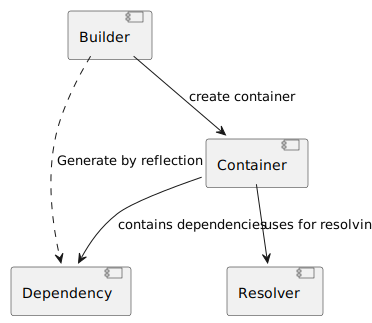

# Dependency Injection [](https://github.com/EdmondDantes/di/actions/workflows/php.yml)

`Dependency Injection` (DI) is a lightweight `PHP` library for dependency injection
for `stateful` application.

The library is designed for `PHP 8.4` using the `LazyProxy API`.

### Features

* Zero configuration. 
Ability to inject dependencies without modifying the code in the dependent class.
* Support for the concept of `environment`/`scope` for dependency lookup. Support **parent/child containers**.
* [Constructor injection](#initialization-through-a-constructor) of dependencies
* [Injection of dependencies into properties](#initialization-through-a-method)
* Injecting configuration values as a Dependency
* [Lazy loading](#lazy-loading) of dependencies
* [Auto dereferencing a `WeakReference` inside the container](#dereferencing-a-weakreference)
* [Handling circular dependencies](#circular-dependencies)
* [Support php-attributes for describing dependencies](#special-attributes)

### Installation

You can install Dependency Injector using Composer. Run the following command:

```bash
composer require ifcastle/di
```

### Basic Usage

The example below demonstrates how the library works with the `SomeClass` class, 
which implements the SomeInterface interface.

The class definition does not depend on the `Dependency Injection` implementation. 
Dependencies are injected via the class `constructor`.

The library automatically binds dependencies to their interfaces.

```php
declare(strict_types=1);

use IfCastle\DI\ContainerBuilder;
use IfCastle\DI\Lazy;

readonly class SomeClass implements SomeInterface
{
    public function __construct(
        // Required dependency
        private SomeRequiredInterface $required,
        // Optional dependency (can be null)
        private SomeOptionalInterface $optional = null,
        // Support a complex dependency type
        private Interface1|Interface2 $someElseUnion,
        // Support a complex dependency type with interception
        private Interface1&Interface2 $someElseInterception,
        // Dependency as configuration value
        private int $configValue = 42,        
    ) {}
}

// 1. Create a container builder

$builder                    = new ContainerBuilder();
// 2. Define the constructible dependencies
$builder->bindConstructible(SomeInterface::class, SomeClass::class);
// 2. Bind several interfaces-aliases or string-key to one class
$builder->bindConstructible([Interface1::class, Interface2::class, 'string-key'], SomeElseClass::class);
// 2. Support WeakReference dereferencing
$builder->bindObject(SomeOptionalInterface::class, WeakReference::create($someObject));
// 2. Define the configuration values
$builder->set('configValue', 42);

// 3. Build the container
$container                  = $builder->buildContainer(new Resolver());

// 4. Get the dependency
$some                       = $container->resolveDependency(SomeInterface::class);

```

### Special Attributes

Attributes provide a more precise way to describe features for dependency resolution.
This library supports several attributes that can be used:

 * `Dependency`     - a general descriptor for a dependency.
 * `FromConfig`     - indicates that the dependency should be retrieved from the configuration.
 * `FromRegistry`   - indicates that the dependency should be retrieved from the registry.

```php

use IfCastle\DI\Dependency;
use IfCastle\DI\FromConfig;

readonly class SomeClass implements SomeInterface
{
    public function __construct(
        #[Dependency(key: SomeRequiredInterface::class)]
        private mixed $required,
        #[Dependency(isLazy: true)]
        private SomeOptionalInterface $optional = null
        #[FromConfig('someClass.configValue')]
        private int $configValue = 0
    ) {}
}


```

### Lazy Loading

The library supports lazy loading of dependencies by special attribute:

```php
use IfCastle\DI\Lazy;

readonly class SomeClass implements SomeInterface
{
    public function __construct(
        #[Lazy] private SomeRequiredInterface $lazy,
    ) {}
}
```

> **Warning**: Lazy dependencies are implemented using the PHP `LazyProxy` API, 
> so the same dependencies in different classes will be **different objects**!
> 
> This means the `===` operation will return `false`, 
> and `spl_object_id()` will return different values.


### Circular Dependencies

The library allows resolving circular dependencies if the dependency is not used during resolution.
If a circular dependency occurs, the library will create a `LazyProxy` object and return it.

> **Warning**: Lazy or circular dependencies cannot be used **BEFORE** 
> the process of resolving all dependencies is completed!
> ```php
> readonly class SomeClass implements SomeInterface
> {
>    public function __construct(
>    #[Lazy] private SomeRequiredInterface $lazy,
>    ) {
>       $lazy->someMethod(); // Error: CircularDependencyException
>   }
> }
> ```

### Custom attributes and Providers

You can create your own attributes to describe dependencies by implementing the DescriptorInterface.

To define a custom algorithm for dependency resolution, 
`DescriptorInterface` can implement the `getProvider` method, 
which returns the dependency.

Below is an example of a method that retrieves a value from the configuration:

```php
    #[\Override]
    public function provide(
        ContainerInterface  $container,
        DescriptorInterface $descriptor,
        ?DependencyInterface $forDependency = null,
        array $resolvingKeys = []
    ): mixed {
        $config                     = $container->findDependency(ConfigInterface::class);

        if ($config === null) {
            return null;
        }

        if ($config instanceof ConfigInterface === false) {
            throw new \TypeError('Config is not an instance of ' . ConfigInterface::class);
        }

        return $config->findValue($this->getKey());
    }

```
This way, you can extend the DI logic without modifying the library's code.

## Performance considerations

The library does not include any compilers for `dependency descriptors`, 
although their implementation is possible. 
All dependency descriptors are resolved dynamically at application startup using the `Reflection API`. 

Is this a performance issue? 
Yes, if you are using `PHP` in a stateless mode, where the PHP process terminates after each request.

For **stateful applications**, dependency resolution occurs once during the application's `warm-up phase` 
or `on-demand`, which aligns with the purpose of this library.

## Architecture



The library consists of four core **components** that interact with each other:

* `Container` — a dependency container. A key-value object that stores dependencies, where the key is typically the full name of an interface, and the value is a scalar value, a dependency descriptor, or an already initialized object.
* `Builder` — a container builder that constructs the container based on the specified dependencies.
* `Resolver` — a strategy that directly resolves dependencies.
* `Dependency` — an object that describes a dependency.

All these components are interchangeable, and by modifying them, you can change the behavior.

### Container

The dependency container follows the `ServiceLocator`/`Environment` **pattern**. 
This means that when attempting to resolve a dependency, the dependencies required by it will also be retrieved 
from the same container. 

In other words, 

> All dependencies in the `container` share the `container` as a common execution `environment`.

You can leverage this fact to create multiple execution environments, each holding its unique dependencies. 
This allows you to implement `Scope logic`, where dependency initialization depends on the environment.

By default, the container is an **immutable object** in terms of associating keys with dependencies. 
However, the container's values change during execution, as dependencies are initialized on their first use, 
replacing dependency descriptors with the actual value.

This container behavior ensures that dependencies are single instances, meaning they are the same object.

#### Container Inheritance

To provide developers with a powerful tool for managing dependencies, 
the `container` supports inheritance based on the override principle. 
This means you can create two separate containers 
with different sets of dependencies and then link them as **PARENT** and **CHILD** containers.

```php

use IfCastle\DI\Container;

$parent = new Container(new Resolver(), ['dependency1' => 'value1']);
$child = new Container(new Resolver(), ['dependency1' => 'value2'], $parent);

echo $child->resolveDependency('dependency1'); // value2

```

In this case, an attempt to resolve a dependency in the child container will result in the following behavior: 
* if the dependency is not found in the child container, the search will continue in the parent container. 
* however, if the child container has a definition for the dependency, it will be used.

#### Dereferencing a WeakReference.

The container supports **dereferencing weak references** 
if they are detected as a value. 

Using weak references is typically useful 
when defining multiple aliases for dependencies or a reference to the container itself. 
In such cases, weak references help avoid additional work for the garbage collector and prevent memory leaks. 

#### Initializer

Sometimes, it is necessary to initialize a dependency not directly through the constructor but with additional code. 
For example, loading a database driver based on configuration or context.

To solve this problem, an initializer can be used: 
a special object executed only once at the moment of dependency resolution.

To implement this approach, the library uses the `InitializerInterface`. 
If the container holds a value of type `InitializerInterface`, the container uses the `executeInitializer` method 
to obtain the dependency.

See [SelfReferenceInitializer](./src/SelfReferenceInitializer.php) as an example of an initializer 
that resolves a dependency from the container.

## Builder

The **container builder** is responsible for constructing the container based on the specified dependencies.

The current implementation uses `PHP Reflection` 
to build the container and supports the following types of dependencies:

* Dependency initialized through a constructor.
* Dependency initialized through a specific method.
* Dependency initialized via an Initializer or a closure.
* Dependency with a ready-to-use object that does not require resolution.
* Constant value.

```php

use IfCastle\DI\ContainerBuilder;
use IfCastle\DI\ContainerInterface;

$builder                    = new ContainerBuilder();
// Constructible dependencies
$builder->bindConstructible(SomeInterface::class, SomeClass::class);
// Injectable dependencies
$builder->bindInjectable(SomeRequiredInterface::class, SomeRequiredClass::class);
// Bind to Initializer 
$builder->bindInitializer(SomeOptionalInterface::class, static function (?ContainerInterface $container = null, array $resolvingKeys = []) {
    return $container->resolveDependency(SomeOptionalInterface::class, resolvingKeys: $resolvingKeys);
});
// Bind to Object
$builder->bindObject('stdClass', new stdClass());

// 3. Build the container
$container                  = $builder->buildContainer(new Resolver());
```

The builder creates a dependency descriptor where the key for the dependency is the data type. 
If a parameter has a default value, the dependency is marked as optional. 
If there is no default value, the dependency is marked as required.

A dependency can have a complex data type defined through PHP `UNION` or `INTERSECTION` expressions.
In this case, the container will look for the dependency using multiple type keys.

### Initialization through a constructor

Initialization through the constructor assumes that all dependencies are defined as constructor parameters. 
In this case, the builder uses the PHP Reflection API to read the constructor's parameter list and their data types.

### Initialization through a method

For **method-based injection**, a special interface `InjectableInterface` and a trait `InjectorTrait` are used, 
which implement the injection method.

In this case, dependencies are described using attributes above the class properties. 
The class can be constructed before the dependencies are resolved.

```php
use IfCastle\DI\Dependency;
use IfCastle\DI\InjectableInterface;
use IfCastle\DI\InjectorTrait;
use IfCastle\DI\Lazy;

final class InjectableClass implements InjectableInterface
{
    use InjectorTrait;

    #[Dependency]
    protected UseConstructorInterface $required;

    #[Dependency]
    protected UseConstructorInterface|null $optional;

    #[Dependency] #[Lazy]
    protected UseConstructorInterface $lazy;

    protected string $data = '';
}

```

### Resolver

The Resolver component is responsible for the dependency resolution process. 
It handles finding dependencies of a dependency and initializing the dependency's class.